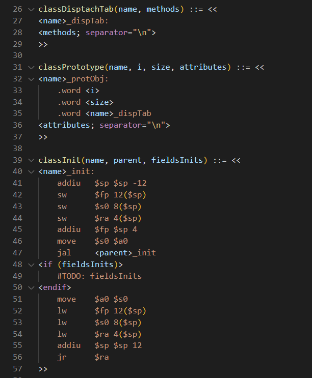

## About The Project

This project is a Visual Studio Code extension for [StringTempalte v4](https://www.stringtemplate.org) language.

## Getting Started

### Manual installation

#### Prerequisites

- The Visual Studio Code Extension Manager

```sh
npm install -g vsce
```

#### Installation

- Clone this project

```sh
git clone https://github.com/dangmarm/stringtemplate-lang.git
```

- Build extension

```sh
vsce package
```

- Install extension

```sh
code --install-extension .\stringtemplate-lang-0.0.1.vsix
```

## Features

- Syntax highlight
- Templates folding
- Shortcut to comment code
- Indent decorator to if ... endif code (does not modify the source code)

### Preview


## Limitations

At this moment it only supports '<>', instead of '$' as a delimiter.

## License

Distributed under the MIT License. See `LICENSE` for more information.
